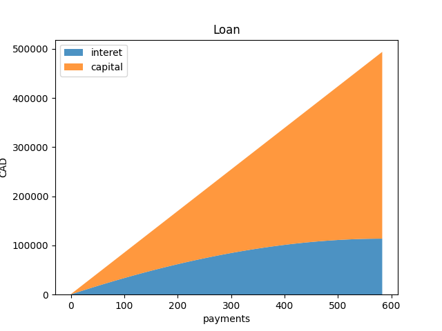
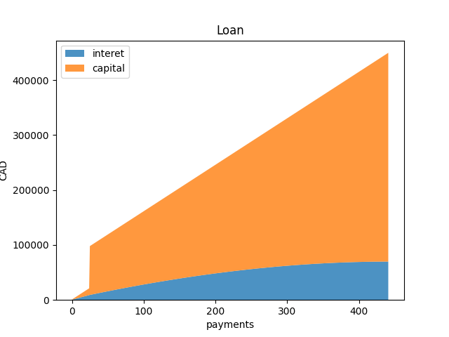

# banque

Calculer son crédit et les avantages de rembourser en avance.

## requirements

```
pip install -r requirements.txt

sudo apt-get install python3-tk  # to see graphs
```

## Dev

```
pip install -r requirements_dev.txt
bash lint.sh
```

## usage

```
python compute.py --help
Usage: compute.py [OPTIONS]

Options:
  --starting-capital FLOAT        Capital you loaned, e.g. 400000  [required]
  --rate FLOAT                    rate loan, e.g. 2.44  [required]
  --payments-per-year INTEGER     number of payments per year, e.g. 26 or 24
  --regular-payment FLOAT         Payment you make on regular basis
                                  [required]
  --early-repayment-amount FLOAT  Early repayment, e.g. 20000
  --early-repayment-time INTEGER  after which payment you do your early
                                  repayment, e.g. 26 == 1 year anniversary
  --help                          Show this message and exit.

```


### examples

```
# see the difference between these two scenarii

# first one: you will pay 584 times for a total of 493'770 CAD
python compute.py --starting-capital 380000 --rate 2.44 --regular-payment 845

# second one: you will pay 441 times for a total of 450'00 CAD
# because we chose to pay early 76kCAD the first anniversary
python compute.py --starting-capital 380000 --rate 2.44 --regular-payment 845 --early-repayment-amount 76000 --early-repayment-time 26
```

Donc on peut dire dans cet exemple, qu'en payant en anticipé 20% du capital de départ (380000 / 5 = 76000) au premier anniversaire, alors on gagne 143 paiements (5 années et demi) et économise 43 kCAD de coût de crédit.

 


## how much capital can you get ?

Script to know how much capital you can get from your bank

## usage

```
Usage: how_much_can_i_loan.py [OPTIONS]

  How much capital can you get from your bank?

Options:
  --credit-duration-in-year INTEGER
                                  How long for your credit in years, e.g. 25
                                  years  [required]
  --rate FLOAT                    rate loan, e.g. 2.44  [required]
  --payments-per-year INTEGER     number of payments per year, e.g. 26 or 24
  --regular-payment FLOAT         Payment you make on regular basis
                                  [required]
  --help                          Show this message and exit.
```

### Example

```
python3.10 how_much_can_i_loan.py --credit-duration-in-year 25 --rate 2.44 --payments-per-year 24 --regular-payment 845.49

You can loan a capital of : 379622.8490621878
  - you will pay 20291.760000000002 per year for 25 years
  - at the end, you will have paid 507294.00000000006
  - full interest amount for the bank will be: 127671.15093781229 (i.e. 25.167092640128264 %)
```
